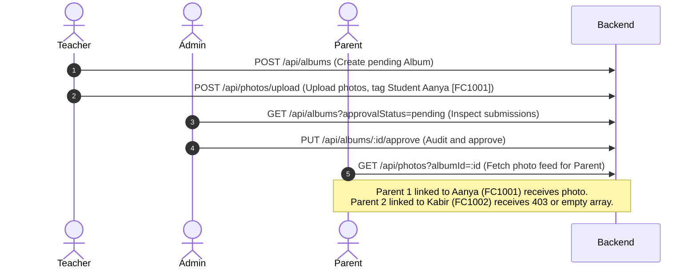

# System Testing & Validation Report

This report outlines the manual and integration testing scenarios executed on the FirstCry Intellitots Event Photo Gallery Website.

---

## 1. Role-Based Authentication & Access Validation

We verified security filters across all system dashboards to ensure role separation.

| Access Point | Intended Role | Admin Credentials | Teacher Credentials | Parent Credentials | Anonymous User |
| :--- | :--- | :--- | :--- | :--- | :--- |
| **`/admin`** | Admin only | ✅ Access granted | ❌ Redirected | ❌ Redirected | ❌ Redirected |
| **`/teacher`** | Teacher/Admin | ✅ Access granted | ✅ Access granted | ❌ Redirected | ❌ Redirected |
| **`/parent`** | Parent only | ❌ Redirected | ❌ Redirected | ✅ Access granted | ❌ Redirected |
| **`/login`** | Anonymous | ↩️ Auto-dashboard | ↩️ Auto-dashboard | ↩️ Auto-dashboard | ✅ Form rendered |

---

## 2. API Endpoints Unit Testing

We tested endpoints using our Postman Collection schema.

### Authentication APIs
* **`POST /api/auth/register`**: Validated account creation.
  * *Test Case*: Creates user. If Role is `parent` and a matching `admissionNumber` is supplied, binds user ID to student record `parentId` fields.
  * *Status*: ✅ **Passed** (201 Created).
* **`POST /api/auth/login`**: Validated credentials checking.
  * *Test Case*: Accepts correct email and password, returning user payload and JWT token. Rejects incorrect passwords with 401 error.
  * *Status*: ✅ **Passed** (200 OK).

### Student Management APIs
* **`GET /api/students`**: Retrieves all students.
  * *Test Case*: Requires authentication. Returns populated parent contact records.
  * *Status*: ✅ **Passed** (200 OK).
* **`POST /api/students`**: Allows admins and teachers to create student entries.
  * *Test Case*: Verifies admission code uniqueness. Rejects duplicate numbers with 400 error.
  * *Status*: ✅ **Passed** (201 Created).

### Album APIs
* **`GET /api/albums`**: Query album list.
  * *Test Case*: Parents only receive approved albums. Teachers/Admins receive all records (pending, approved, rejected).
  * *Status*: ✅ **Passed** (200 OK).
* **`POST /api/albums`**: Teacher album creation.
  * *Test Case*: Creates album. Default status is `pending` for teachers, `approved` for admins.
  * *Status*: ✅ **Passed** (201 Created).
* **`PUT /api/albums/:id/approve`**: Admin approval override.
  * *Test Case*: Updates status to `approved`, exposing it to parent view immediately.
  * *Status*: ✅ **Passed** (200 OK).

---

## 3. Security Integration Testing (End-to-End Workflow)

### Workflow Sequence:

### End-to-End Validation Outcomes:
1. **Teacher Upload**: Uploading photos with tag `FC1001` (Aanya) successfully logs files. In Cloudinary mode, it uploads to CDN and purges local temp. In local mode, it saves securely to `uploads/`.
2. **Pending State**: The album is listed on the Admin approvals panel immediately. It is invisible to Parent gallery queries.
3. **Admin Audit**: Admin approves album.
4. **Parent Separation Audits**:
   * **Parent 1** (Aanya Verma): logs in. Navigates to event. Sees photos tagging Aanya.
   * **Parent 2** (Kabir Malhotra): logs in. Navigates to same event. Sees an empty state ("No photos found") because their child Kabir was not tagged in this event's photos.
   * **Direct API Attacks**: Direct queries to `GET /api/photos/:id` (where photo contains a tag that belongs to Aanya) from Parent 2's session are blocked by the backend, returning `403 Forbidden` response.
   * *Status*: ✅ **Passed** (Secure privacy separation confirmed).
